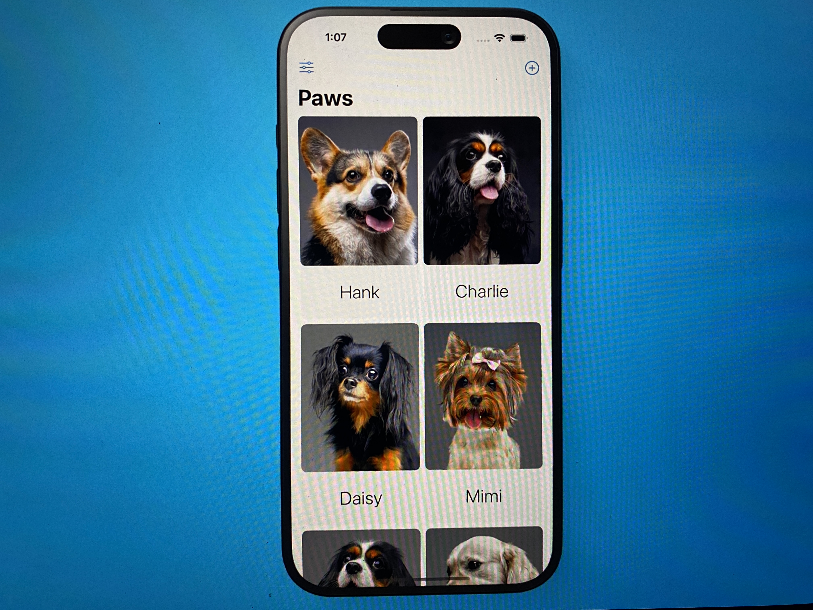
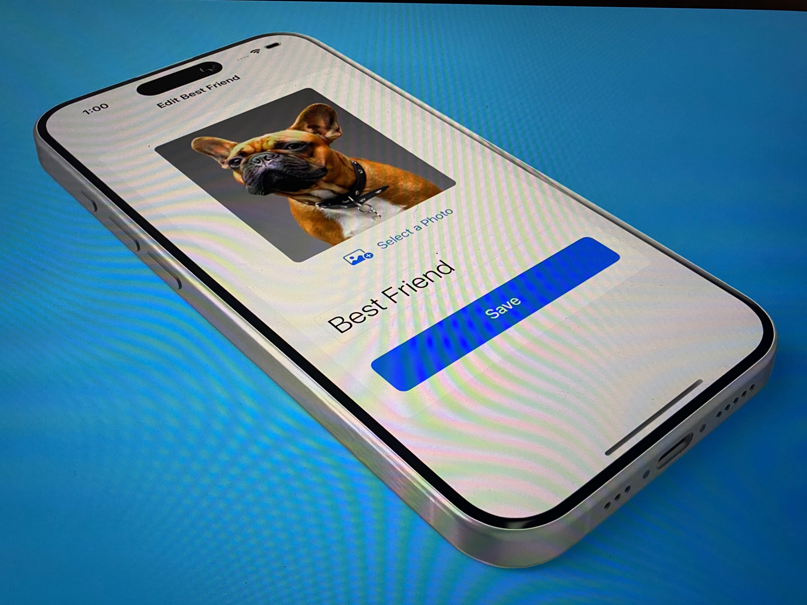
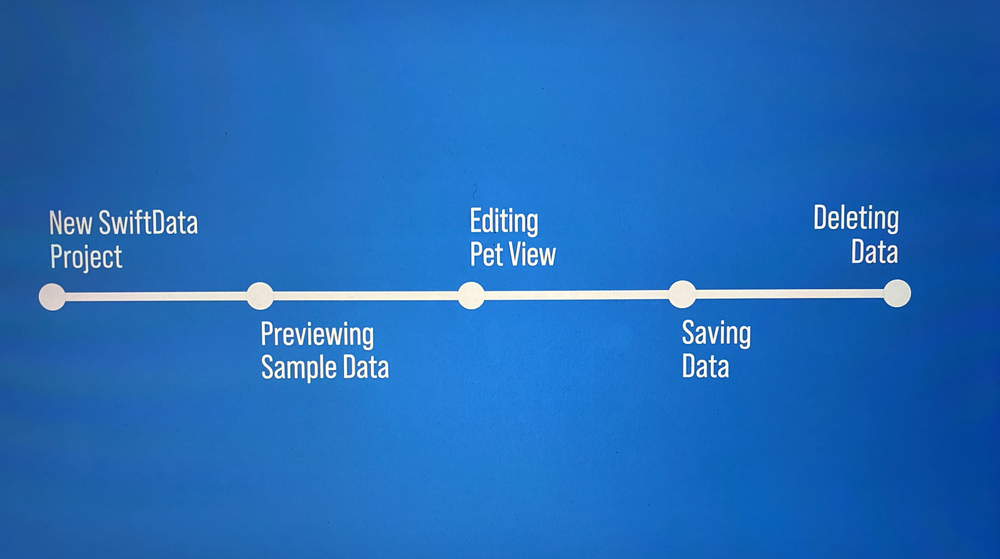

# 🐾 Paws App (SwiftUI + SwiftData + PhotosPicker)



[](https://swift.org)
[](https://developer.apple.com/xcode/)
[](https://developer.apple.com/ios/)
[](https://developer.apple.com/xcode/swiftui/)
[](https://developer.apple.com/documentation/swiftdata)
[](https://developer.apple.com/documentation/photokit)

---

## 📌 Description
**Paws** est une application de gestion d'animaux de compagnie développée avec **SwiftUI** et **SwiftData**. Cette app permet de créer un carnet de bord complet pour vos compagnons à quatre pattes avec photos, informations personnalisées et fonctionnalités de gestion complètes.  
L'objectif est d'explorer les fonctionnalités modernes d'iOS comme **@Bindable**, **PhotosPicker** et les **menus contextuels** pour créer une expérience utilisateur fluide et intuitive.

---

## ✨ Fonctionnalités

- 🐕 **Gestion complète des animaux** : Ajout, modification et suppression d'animaux de compagnie
- 📱 **Interface en grille** : Affichage moderne des animaux avec LazyVGrid
- 📸 **Intégration photos** : Sélection et affichage de photos depuis la galerie avec PhotosPicker
- ✏️ **Édition en temps réel** : Modification des données avec @Bindable pour une synchronisation automatique
- 🗑️ **Menu de suppression** : Menu contextuel pour supprimer facilement un animal
- 💾 **Persistance automatique** : Sauvegarde instantanée avec SwiftData
- 🎨 **Design moderne** : Interface utilisateur élégante avec effets de transparence

---



## 📱 Aperçu de l'application

L'application offre une interface intuitive avec :
- Une grille d'affichage des animaux avec leurs photos et noms
- Un système d'ajout rapide avec sélection de photos
- Des formulaires d'édition avec validation en temps réel
- Des menus contextuels pour les actions de gestion
- Un état vide personnalisé quand aucun animal n'est enregistré

---



## 📚 Ce que j'ai appris

En développant cette app, j'ai pu maîtriser des concepts avancés de SwiftUI et SwiftData :

1. **SwiftData CRUD Operations** – Implémentation complète des opérations Create, Read, Update, Delete
2. **@Bindable Property Wrapper** – Gestion des données éditables avec synchronisation automatique
3. **PhotosPicker Integration** – Sélection et gestion d'images depuis la galerie de l'appareil
4. **LazyVGrid Layout** – Création d'interfaces en grille performantes et responsive
5. **Context Menus** – Implémentation de menus contextuels pour les actions utilisateur
6. **Custom Empty States** – Gestion des états vides avec des vues personnalisées
7. **Data Binding** – Liaison bidirectionnelle entre l'interface et les modèles de données

---

## 🛠 Technologies utilisées

- **SwiftUI** : Framework d'interface utilisateur déclaratif
- **SwiftData** : Framework de persistance moderne d'Apple
- **PhotosPicker** : Sélection de photos depuis la galerie
- **@Bindable** : Property wrapper pour les données éditables
- **LazyVGrid** : Layout en grille performant
- **iOS 17+** : Fonctionnalités modernes du système

---

## 🚀 Installation et Lancement du projet

### 1️⃣ Prérequis
- **Xcode 15+** installé sur votre Mac
- **iOS 17+** pour tester sur simulateur ou appareil physique
- **Swift 5.10+**

### 2️⃣ Cloner le projet
```bash
git clone https://github.com/[votre-username]/Paws.git
cd Paws
```


### 3️⃣ Ouvrir le projet
```bash
open Paws.xcodeproj
```

### 4️⃣ Lancer l'application
- Sélectionnez votre simulateur iOS ou appareil physique
- Appuyez sur ⌘ + R pour compiler et lancer l'app

## License
[MIT License](https://github.com/josue-lubaki/Paws/blob/main/LICENSE)

```
MIT License

Copyright (c) 2025 Josue Lubaki

Permission is hereby granted, free of charge, to any person obtaining a copy
of this software and associated documentation files (the "Software"), to deal
in the Software without restriction, including without limitation the rights
to use, copy, modify, merge, publish, distribute, sublicense, and/or sell
copies of the Software, and to permit persons to whom the Software is
furnished to do so, subject to the following conditions:

The above copyright notice and this permission notice shall be included in all
copies or substantial portions of the Software.

THE SOFTWARE IS PROVIDED "AS IS", WITHOUT WARRANTY OF ANY KIND, EXPRESS OR
IMPLIED, INCLUDING BUT NOT LIMITED TO THE WARRANTIES OF MERCHANTABILITY,
FITNESS FOR A PARTICULAR PURPOSE AND NONINFRINGEMENT. IN NO EVENT SHALL THE
AUTHORS OR COPYRIGHT HOLDERS BE LIABLE FOR ANY CLAIM, DAMAGES OR OTHER
LIABILITY, WHETHER IN AN ACTION OF CONTRACT, TORT OR OTHERWISE, ARISING FROM,
OUT OF OR IN CONNECTION WITH THE SOFTWARE OR THE USE OR OTHER DEALINGS IN THE
SOFTWARE.
```
